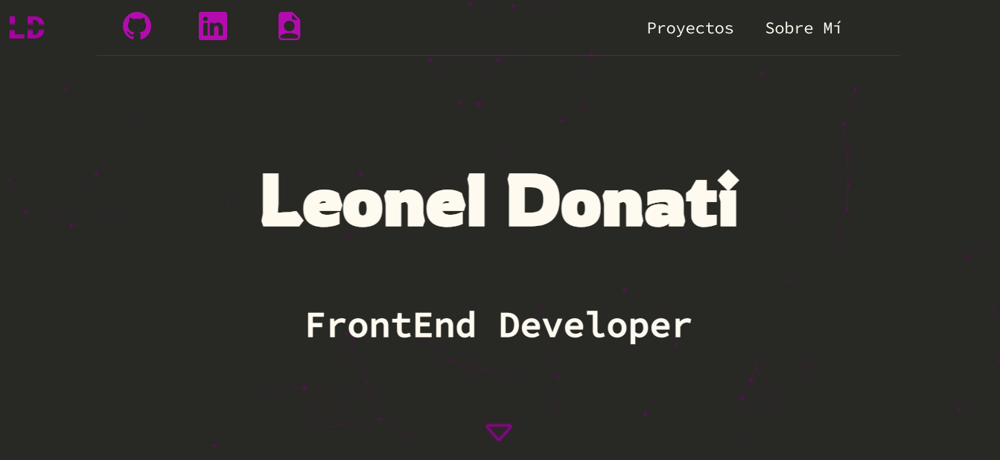
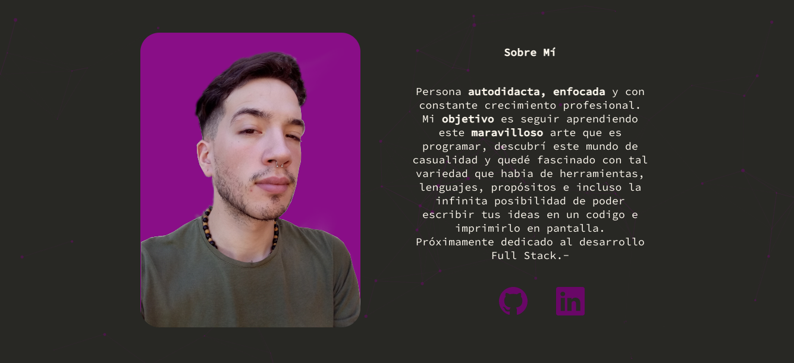

# Portafolio creado con HTML, CSS y Javascript.

Se usó librerías Javascript para crear animaciones.

Durante el proceso de creación del portfolio he aprendido los conceptos de paleta de colores, variables css, metodología **SUIT CSS** y animaciones con **'@keyframes'**.

## Animaciones con @keyframes.
---
```css
/* animacion svg */
@keyframes jumping {
  0% {
    transform: translateY(0);
  }

  100% {
    transform: translateY(0.2em);
  }
}
@keyframes filter {
  0% {
    filter: drop-shadow(0 0 0.1em var(--color_secundario));
  }

  100% {
    filter: drop-shadow(0 0 0.3em var(--color_complementario));
  }
}

```
>Animación de salto.

## Capturas de pantalla.
---

>Inicio de página



>Sección sobre mí



Si gustas mirar mas a fondo el proyecto podes revisar el repo que tengo en GitHub!

*Leonel Donati . -*

